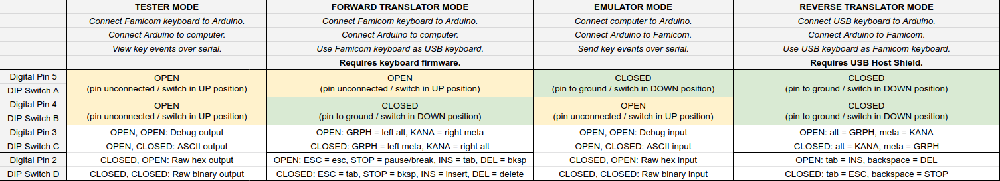
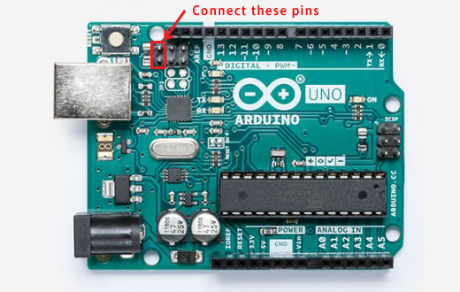
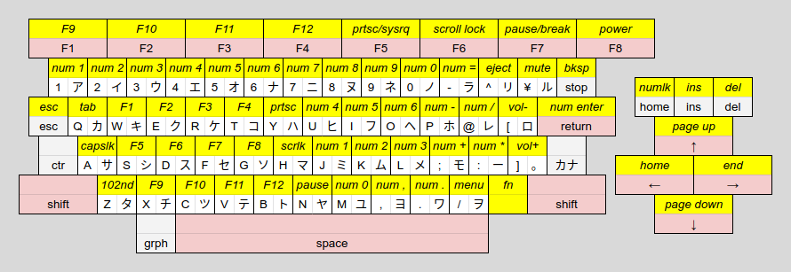
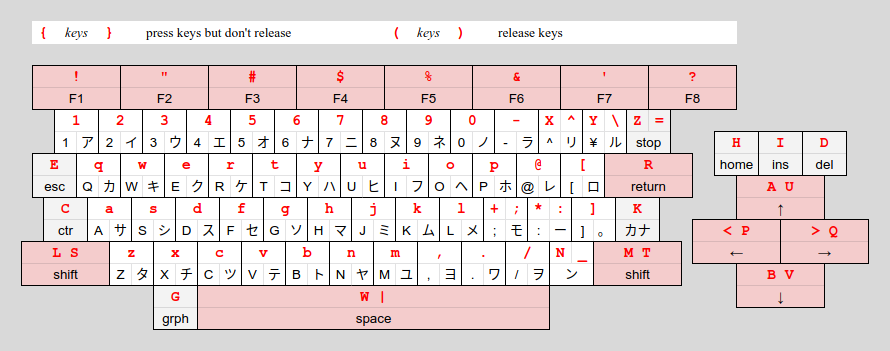
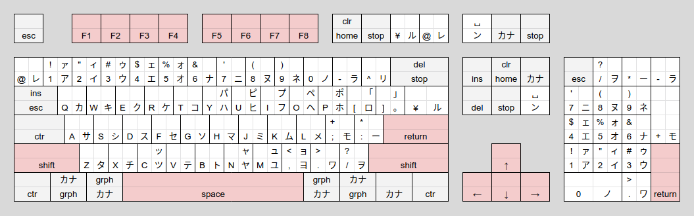

# FamiKeys
Famicom Keyboard Tester/Translator/Emulator

This Arduino sketch can function in four different modes:

* Tester Mode: Capture keystrokes from a Famicom keyboard and print them over serial.
* Forward Translator Mode: Use a Famicom keyboard as a USB keyboard on a modern device.
* Emulator Mode: Read instructions over serial and send keystrokes to a Famicom.
* Reverse Translator Mode: Use a modern USB keyboard as a keyboard on a Famicom.

To compile the sketch you must add the USB Host Shield library to the Arduino IDE, found [here](https://github.com/felis/USB_Host_Shield_2.0). Or, if you do not plan to use Reverse Translator Mode, you can comment out the line `#define USBK_USE_HOST_SHIELD` in `usbkeysconfig.h`.

There are also gerber files for a shield to make connections and configuration easier.

## Connections

### Famicom Keyboard Connections
* Pin 1, GND: connect to Arduino GND.
* Pin 7, P2 D1: connect to Arduino analog pin A0.
* Pin 6, P2 D2: connect to Arduino analog pin A1.
* Pin 5, P2 D3: connect to Arduino analog pin A2.
* Pin 4, P2 D4: connect to Arduino analog pin A3.
* Pin 12, OUT0: connect to Arduino analog pin A4.
* Pin 11, OUT1: connect to Arduino analog pin A5.
* Pin 10, OUT2: connect to Arduino digital pin 6.
* Pin 15, VCC: connect to Arduino +5V.

### Arduino Connections
* Digital pins 0-1: reserved for serial port.
* Digital pins 2-5: used to select settings.
* Digital pin 6: connect to Famicom OUT2 (pin 10).
* Digital pins 7-13: reserved for USB Host Shield.
* Analog pin A5: connect to Famicom OUT1 (pin 11).
* Analog pin A4: connect to Famicom OUT0 (pin 12).
* Analog pin A3: connect to Famicom P2 D4 (pin 4).
* Analog pin A2: connect to Famicom P2 D3 (pin 5).
* Analog pin A1: connect to Famicom P2 D2 (pin 6).
* Analog pin A0: connect to Famicom P2 D1 (pin 7).

### "DIP Switch" Settings
Digital pins 2-5 are used to select the mode of operation and settings for that mode. These are present on the shield as switches or jumpers labeled A-D. To leave the "DIP switch" in the OPEN position, leave the pin disconnected or set the switch to the UP position. To leave the "DIP switch" in the CLOSED position, connect the pin to GND or set the switch to the DOWN position.

* Digital pin 5 / switch A:
  * OPEN: `FK>` - Famicom Keyboard In. Tester / Forward Translator Mode. Connect Famicom keyboard to Arduino and Arduino to modern device.
  * CLOSED: `>FH` - To Famicom Host. Emulator / Reverse Translator Mode. Connect modern device to Arduino and Arduino to Famicom.
* Digital pin 4 / switch B:
  * OPEN: `SER` - Serial. Tester / Emulator Mode. Arduino communicates with a modern device over serial.
  * CLOSED: `USB`. Translator Mode. Arduino acts as a USB keyboard device or host, depending on switch A.
* Digital pin 3 / switch C:
  * In Tester / Emulator Mode:
    * OPEN: Key events are output / input as debug statements or ASCII characters.
    * CLOSED: Key events are output / input as raw hex dump or raw binary.
  * In Forward Translator Mode:
    * OPEN: GRPH = Alt, カナ (KANA) = Meta.
    * CLOSED: GRPH = Meta, カナ (KANA) = Alt.
  * In Reverse Translator Mode:
    * OPEN: Alt = GRPH, Meta = カナ (KANA).
    * CLOSED: Meta = GRPH, Alt = カナ (KANA).
* Digital pin 2 / switch D:
  * In Tester / Emulator Mode:
    * OPEN: Key events are output / input as debug statements or raw hex dump.
    * CLOSED: Key events are output / input as ASCII characters or raw binary.
  * In Forward Translator Mode:
    * OPEN: ESC = Esc, STOP = Pause/Break, INS = Tab, DEL = Backspace.
    * CLOSED: ESC = Tab, STOP = Backspace, INS = Insert, DEL = Delete.
  * In Reverse Translator Mode:
    * OPEN: Tab = INS, Backspace = DEL.
    * CLOSED: Tab = ESC, Backspace = STOP.

## Tester Mode
Connect a Famicom keyboard to the Arduino. Connect the Arduino to a modern device over USB. Connect to the Arduino from the modern device over USB serial at 9600 baud (using the Arduino Serial Monitor, for example). Key events coming from the Famicom keyboard will be printed over serial.

With digital pins 3, 2 / switches C, D both OPEN, key events will be printed as messages, as in the following example output.

    READY
    PRESSED 3E 1
    RELEASED 3E 1
    PRESSED 39 Esc
    RELEASED 39 Esc
    PRESSED 3B Ctr
    PRESSED 33 A
    RELEASED 33 A
    RELEASED 3B Ctr
    PRESSED 3D Grph
    PRESSED 35 Z
    RELEASED 35 Z
    RELEASED 3D Grph

With digital pin 3 / switch C OPEN and digital pin 2 / switch D CLOSED, key presses will be output as ASCII. Modifier keys will not generate output by themselves, only in combination with another key. The Ctr (Control) and Shift keys behave as expected. The Grph key sets the high bit. The above sequence of key events will produce the byte sequence `31 1B 01 FA`.

With digital pin 3 / switch C CLOSED and digital pin 2 / switch D OPEN, key events will be printed as raw hex dump. The above sequence of key events will produce the ASCII string `BE3EB939BBB3333BBDB5353D`.

With digital pins 3, 2 / switches C, D both CLOSED, key events will be output as raw binary. The above sequence of key events will produce the byte sequence `BE 3E B9 39 BB B3 33 3B BD B5 35 3D`.

### Switch Settings
* Digital pins 5, 4 / switches A, B must both be OPEN in this mode.
* Digital pins 3, 2 / switches C, D select the format of the output:
  * OPEN, OPEN: Key events are output as a one-line message describing the event.
  * OPEN, CLOSED: Key presses are output as ASCII.
  * CLOSED, OPEN: Key events are output as raw hex dump.
  * CLOSED, CLOSED: Key events are output as raw binary.

## Forward Translator Mode
To use Forward Translator Mode, you must first reflash the Arduino's USB controller with firmware that will allow the Arduino to function as a USB keyboard. Once you do this, you won't be able to program the Arduino until you reverse the process, so upload the sketch to the Arduino first.

### Reflashing the USB Controller Firmware
* Download the file `Arduino-keyboard-0.3.hex` in the `firmware` directory.
* Download and install ATMEL FLIP from https://www.microchip.com/developmenttools/ProductDetails/FLIP
* Connect the Arduino.
* Short the two male header pins on the Arduino closest to the USB port for a few seconds. (If you're on Windows, you should hear the "device disconnected" sound when connecting the pins and the "device connected" sound when disconnecting the pins.)

* Open ATMEL FLIP.
* Click the button for "Select a Target Device" and select ATmega16U2.
* Click the button for "Select a Communication Medium" and select USB, then click Open.
* Go to Buffer > Options. Make sure "Reset Buffer Before Loading" is set to Yes and "Address Programming Range" is set to Whole Buffer.
* If this is your first time doing this:
  * Click the button for "Read Target Device Memory".
  * Click the button for "Save Buffer As HEX File" and save it as, for example, `arduino.hex`. (You can use this file later to turn your Arduino from a keyboard back into an Arduino.)
* Click the button for "Load HEX File" and select the `Arduino-keyboard-0.3.hex` file.
* Click the Run button.
* Once the programming is done, disconnect the Arduino.

To reverse this process, do the same thing but select your saved `arduino.hex` file instead of the `Arduino-keyboard-0.3.hex` file.

### Using Forward Translator Mode
Connect a Famicom keyboard to the Arduino. Connect the Arduino to a modern device over USB. Use the Famicom keyboard as a USB keyboard. Most of the key mappings are obvious; the not-so-obvious ones are:

* \- = ラ maps to - _
* ^ リ maps to = +
* ¥ ル maps to \ |
* STOP maps to Pause/Break if pin 2 / switch D is OPEN or Backspace if pin 2 / switch D is CLOSED
* ESC maps to Esc if pin 2 / switch D is OPEN or Tab if pin 2 / switch D is CLOSED
* @ レ maps to ` ~
* ; + モ maps to ; :
* : * ー maps to ' "
* カナ (KANA) maps to Right Meta if pin 3 / switch C is OPEN or Right Alt if pin 3 / switch C is CLOSED
* GRPH maps to Left Alt if pin 3 / switch C is OPEN or Left Meta if pin 3 / switch C is CLOSED
* CLR/HOME maps to Home
* INS maps to Tab if pin 2 / switch D is OPEN or Insert if pin 2 / switch D is CLOSED
* DEL maps to Backspace if pin 2 / switch D is OPEN or Delete if pin 2 / switch D is CLOSED

Since the Famicom keyboard has fewer keys than a modern keyboard, the ン ␣ key (to the left of the right shift key) selects alternate interpretations for the keys. These key mappings are not affected by the switch settings.

* ン + F1 = F9
* ン + F2 = F10
* ン + F3 = F11
* ン + F4 = F12
* ン + F5 = Print Screen
* ン + F6 = Scroll Lock
* ン + F7 = Pause/Break
* ン + F8 = Power
* ン + Number Key = Numpad Key
* ン + - = Numpad =
* ン + ^ = Eject
* ン + ¥ = Mute
* ン + STOP = Backspace (regardless of pin 2 / switch D)
* ン + ESC = Esc (regardless of pin 2 / switch D)
* ン + Q = Tab
* ン + P = Numpad -
* ン + @ = Numpad /
* ン + [ = Volume Down
* ン + RETURN = Numpad Enter
* ン + A = Caps Lock
* ン + ; = Numpad +
* ン + : = Numpad *
* ン + ] = Volume Up
* ン + Z = 102nd
* ン + , = Numpad ,
* ン + . = Numpad .
* ン + / = Menu
* ン + CLR/HOME = Num Lock
* ン + INS = Insert (regardless of pin 2 / switch D)
* ン + DEL = Delete (regardless of pin 2 / switch D)
* ン + Up Arrow = Page Up
* ン + Left Arrow = Home
* ン + Right Arrow = End
* ン + Down Arrow = Page Down

### Switch Settings
* Digital pin 5 / switch A must be OPEN.
* Digital pin 4 / switch B must be CLOSED.
* Digital pin 3 / switch C selects the interpretation of the modifier keys:
  * OPEN: GRPH = Left Alt, カナ (KANA) = Right Meta
  * CLOSED: GRPH = Left Meta, カナ (KANA) = Right Alt
* Digital pin 2 / switch D selects the interpretation of the ESC, STOP, INS, and DEL keys:
  * OPEN: ESC = Esc, STOP = Pause/Break, INS = Tab, DEL = Backspace
  * CLOSED: ESC = Tab, STOP = Backspace, INS = Insert, DEL = Delete

## Emulator Mode
Connect a modern device to the Arduino over USB. Connect the Arduino to the Famicom expansion port. Connect to the Arduino from the modern device over USB serial at 9600 baud (using the Arduino Serial Monitor, for example).

With digital pins 3, 2 / switches C, D both OPEN, each line of input (up to 80 characters) will be sent to the Famicom as keystrokes. The first character of each line determines the interpretation of the rest of the line.

* `!` - Prints the amount of free RAM on the Arduino.
* `@` - The rest of the line is interpreted as ASCII. Key events are sent to generate each character.
* `#` - The rest of the line is ignored.
* `$` - The rest of the line is interpreted as a hex dump and sent as raw key event data.
* `&` - Characters are mapped to keys:
  * `{` *keys* `}` - The keys contained inside the braces are pressed but not released.
  * `(` *keys* `)` - The keys contained inside the parentheses are released but not pressed.
  * `0` through `9` - Number keys.
  * `a` through `z` - Letter keys. Always lowercase.
  * `-`, `^`, `@`, `[`, `]`, `;`, `:`, `+`, `*`, `,`, `.`, `/` - Corresponding symbol keys.
  * `A` or `U` - Up Arrow
  * `B` or `V` - Down Arrow
  * `C` - Ctl
  * `D` - Del
  * `E` - Esc
  * `G` - Grph
  * `H` - Clr/Home
  * `I` - Ins
  * `K` - カナ (KANA)
  * `L` or `S` - Left Shift
  * `M` or `T` - Right Shift
  * `N` or `_` - ン ␣
  * `P` or `<` - Left Arrow
  * `Q` or `>` - Right Arrow
  * `R` - Return
  * `W` or `|` - Space
  * `X` or `^` - ^ リ
  * `Y` or `\` - ¥ ル
  * `Z` or `=` - Stop
  * `!` - F1
  * `"` - F2
  * `#` - F3
  * `$` - F4
  * `%` - F5
  * `&` - F6
  * `'` - F7
  * `?` - F8
  * For example, to send a Ctr + A keystroke: `&{C}a(C)`
  * For example, to send a Shift + Grph + ¥ keystroke: `&{GS}Y(GS)`

With digital pin 3 / switch C OPEN and digital pin 2 / switch D CLOSED, received characters will be interpreted as ASCII. Key events will be sent to generate each character.

With digital pin 3 / switch C CLOSED and digital pin 2 / switch D OPEN, received characters will be interpreted as a hex dump of key events as produced by Tester mode.

With digital pins 3, 2 / switches C, D both CLOSED, received characters will be interpreted as raw binary key events as produced by Tester mode.

### Switch Settings
* Digital pin 5 / switch A must be CLOSED.
* Digital pin 4 / switch B must be OPEN.
* Digital pins 3, 2 / switches C, D select the format of the input:
  * OPEN, OPEN: Key events are generated from debug commands.
  * OPEN, CLOSED: Key events are generated from ASCII input.
  * CLOSED, OPEN: Key events are input as raw hex dump.
  * CLOSED, CLOSED: Key events are input as raw binary.

## Reverse Translator Mode
To use Reverse Translator Mode, you must add a USB Host Shield to the Arduino. [Sparkfun has one for sale.](https://www.sparkfun.com/products/9947) You must also add the USB Host Shield library to the Arduino IDE, found [here](https://github.com/felis/USB_Host_Shield_2.0).

If using the Sparkfun USB Host Shield, you'll need to add a wire from digital pin 7 to the RESET line. Additionally, if you are using an Arduino Mega, you'll need to route pins 13, 12, 11, and 10 to pins 52, 50, 51, and 53, respectively.

Connect a USB keyboard to the USB Host Shield. Connect the Arduino to the Famicom expansion port. Use the USB keyboard as the Famicom's keyboard.

* Tab can be mapped to either INS (if pin 2 / switch D is OPEN) or ESC (if pin 2 / switch D is CLOSED). (INS is always accessible via Insert, and ESC is always accessible via Esc.)
* Backspace can be mapped to either DEL (if pin 2 / switch D is OPEN) or STOP (if pin 2 / switch D is CLOSED). (DEL is always accessible via Delete, and STOP is always accessible via Pause/Break.)
* All numpad keys are mapped to the corresponding keys for their characters, automatically shifted as necessary (for the + and * keys).
* ESC can be accessed using Esc or Num Lock
* INS can be accessed using Insert
* DEL can be accessed using Delete
* CLR/HOME can be accessed using F9 or Home
* STOP can be accessed using F10, Pause/Break, or End
* カナ (KANA) can be accessed using Scroll Lock or Page Up
* ン ␣ can be accessed using Print Screen or Page Down
* \- = ラ can be accessed using - _
* ^ リ can be accessed using = +
* ¥ ル can be accessed using \ | or F11
* @ レ can be accessed using ` ~ or F12
* ; + モ can be accessed using ; :
* : * ー can be accessed using ' "

### Switch Settings
* Digital pins 5, 4 / switches A, B must be CLOSED.
* Digital pin 3 / switch C selects the interpretation of the modifier keys:
  * OPEN: Alt = GRPH, Meta = カナ (KANA)
  * CLOSED: Meta = GRPH, Alt = カナ (KANA)
* Digital pin 2 / switch D selects the interpretation of the Tab and Backspace keys:
  * OPEN: Tab = INS, Backspace = DEL
  * CLOSED: Tab = ESC, Backspace = STOP

